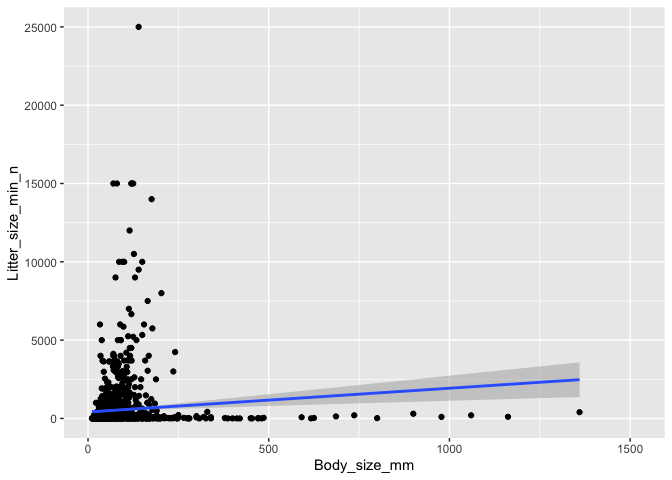

## Instructions
Answer the following questions and complete the exercises in RMarkdown. Please embed all of your code and push your final work to your repository. Your final lab report should be organized, clean, and run free from errors. Remember, you must remove the `#` for the included code chunks to run.  

## Libraries

```r
library(tidyverse)
```

```
## ── Attaching packages ─────────────────────────────────────────────────────────────────────────────────────────────────────── tidyverse 1.3.0 ──
```

```
## ✓ ggplot2 3.2.1     ✓ purrr   0.3.3
## ✓ tibble  2.1.3     ✓ dplyr   0.8.4
## ✓ tidyr   1.0.2     ✓ stringr 1.4.0
## ✓ readr   1.3.1     ✓ forcats 0.4.0
```

```
## ── Conflicts ────────────────────────────────────────────────────────────────────────────────────────────────────────── tidyverse_conflicts() ──
## x dplyr::filter() masks stats::filter()
## x dplyr::lag()    masks stats::lag()
```

```r
library(naniar)
library(skimr)
```

```
## 
## Attaching package: 'skimr'
```

```
## The following object is masked from 'package:naniar':
## 
##     n_complete
```

## Data
For this homework, we will use two different data sets. Please load `amniota` and `amphibio`.  

### `amniota` data
Myhrvold N, Baldridge E, Chan B, Sivam D, Freeman DL, Ernest SKM (2015). “An amniote life-history
database to perform comparative analyses with birds, mammals, and reptiles.” _Ecology_, *96*, 3109.
doi: 10.1890/15-0846.1 (URL: https://doi.org/10.1890/15-0846.1).

```r
amniota <- 
  readr::read_csv("data lab 5 /amniota.csv")
```

```
## Parsed with column specification:
## cols(
##   .default = col_double(),
##   class = col_character(),
##   order = col_character(),
##   family = col_character(),
##   genus = col_character(),
##   species = col_character(),
##   common_name = col_character()
## )
```

```
## See spec(...) for full column specifications.
```

```r
amniota
```

```
## # A tibble: 21,322 x 36
##    class order family genus species subspecies common_name female_maturity…
##    <chr> <chr> <chr>  <chr> <chr>        <dbl> <chr>                  <dbl>
##  1 Aves  Acci… Accip… Acci… albogu…       -999 Pied Gosha…            -999 
##  2 Aves  Acci… Accip… Acci… badius        -999 Shikra                  363.
##  3 Aves  Acci… Accip… Acci… bicolor       -999 Bicolored …            -999 
##  4 Aves  Acci… Accip… Acci… brachy…       -999 New Britai…            -999 
##  5 Aves  Acci… Accip… Acci… brevip…       -999 Levant Spa…             363.
##  6 Aves  Acci… Accip… Acci… castan…       -999 Chestnut-f…            -999 
##  7 Aves  Acci… Accip… Acci… chilen…       -999 Chilean Ha…            -999 
##  8 Aves  Acci… Accip… Acci… chiono…       -999 White-brea…             548.
##  9 Aves  Acci… Accip… Acci… cirroc…       -999 Collared S…            -999 
## 10 Aves  Acci… Accip… Acci… cooper…       -999 Cooper's H…             730 
## # … with 21,312 more rows, and 28 more variables:
## #   litter_or_clutch_size_n <dbl>, litters_or_clutches_per_y <dbl>,
## #   adult_body_mass_g <dbl>, maximum_longevity_y <dbl>, gestation_d <dbl>,
## #   weaning_d <dbl>, birth_or_hatching_weight_g <dbl>, weaning_weight_g <dbl>,
## #   egg_mass_g <dbl>, incubation_d <dbl>, fledging_age_d <dbl>,
## #   longevity_y <dbl>, male_maturity_d <dbl>,
## #   inter_litter_or_interbirth_interval_y <dbl>, female_body_mass_g <dbl>,
## #   male_body_mass_g <dbl>, no_sex_body_mass_g <dbl>, egg_width_mm <dbl>,
## #   egg_length_mm <dbl>, fledging_mass_g <dbl>, adult_svl_cm <dbl>,
## #   male_svl_cm <dbl>, female_svl_cm <dbl>, birth_or_hatching_svl_cm <dbl>,
## #   female_svl_at_maturity_cm <dbl>, female_body_mass_at_maturity_g <dbl>,
## #   no_sex_svl_cm <dbl>, no_sex_maturity_d <dbl>
```

### `amphibio` data
Oliveira BF, São-Pedro VA, Santos-Barrera G, Penone C, Costa GC (2017). “AmphiBIO, a global database
for amphibian ecological traits.” _Scientific Data_, *4*, 170123. doi: 10.1038/sdata.2017.123 (URL:
https://doi.org/10.1038/sdata.2017.123).

```r
amphibio <- 
  readr::read_csv("data lab 5 /amphibio.csv")
```

```
## Parsed with column specification:
## cols(
##   .default = col_double(),
##   id = col_character(),
##   Order = col_character(),
##   Family = col_character(),
##   Genus = col_character(),
##   Species = col_character(),
##   Seeds = col_logical(),
##   OBS = col_logical()
## )
```

```
## See spec(...) for full column specifications.
```

```
## Warning: 125 parsing failures.
##  row col           expected                                                           actual                       file
## 1410 OBS 1/0/T/F/TRUE/FALSE Identified as P. appendiculata in Boquimpani-Freitas et al. 2002 'data lab 5 /amphibio.csv'
## 1416 OBS 1/0/T/F/TRUE/FALSE Identified as T. miliaris in Giaretta and Facure 2004            'data lab 5 /amphibio.csv'
## 1447 OBS 1/0/T/F/TRUE/FALSE Considered endangered by Soto-Azat et al. 2013                   'data lab 5 /amphibio.csv'
## 1448 OBS 1/0/T/F/TRUE/FALSE Considered extinct by Soto-Azat et al. 2013                      'data lab 5 /amphibio.csv'
## 1471 OBS 1/0/T/F/TRUE/FALSE nomem dubitum                                                    'data lab 5 /amphibio.csv'
## .... ... .................. ................................................................ ..........................
## See problems(...) for more details.
```

```r
amphibio
```

```
## # A tibble: 6,776 x 38
##    id    Order Family Genus Species   Fos   Ter   Aqu   Arb Leaves Flowers Seeds
##    <chr> <chr> <chr>  <chr> <chr>   <dbl> <dbl> <dbl> <dbl>  <dbl>   <dbl> <lgl>
##  1 Anf0… Anura Allop… Allo… Alloph…    NA     1     1     1     NA      NA NA   
##  2 Anf0… Anura Alyti… Alyt… Alytes…    NA     1     1     1     NA      NA NA   
##  3 Anf0… Anura Alyti… Alyt… Alytes…    NA     1     1     1     NA      NA NA   
##  4 Anf0… Anura Alyti… Alyt… Alytes…    NA     1     1     1     NA      NA NA   
##  5 Anf0… Anura Alyti… Alyt… Alytes…    NA     1    NA     1     NA      NA NA   
##  6 Anf0… Anura Alyti… Alyt… Alytes…     1     1     1     1     NA      NA NA   
##  7 Anf0… Anura Alyti… Disc… Discog…     1     1     1    NA     NA      NA NA   
##  8 Anf0… Anura Alyti… Disc… Discog…     1     1     1    NA     NA      NA NA   
##  9 Anf0… Anura Alyti… Disc… Discog…     1     1     1    NA     NA      NA NA   
## 10 Anf0… Anura Alyti… Disc… Discog…     1     1     1    NA     NA      NA NA   
## # … with 6,766 more rows, and 26 more variables: Fruits <dbl>, Arthro <dbl>,
## #   Vert <dbl>, Diu <dbl>, Noc <dbl>, Crepu <dbl>, Wet_warm <dbl>,
## #   Wet_cold <dbl>, Dry_warm <dbl>, Dry_cold <dbl>, Body_mass_g <dbl>,
## #   Age_at_maturity_min_y <dbl>, Age_at_maturity_max_y <dbl>,
## #   Body_size_mm <dbl>, Size_at_maturity_min_mm <dbl>,
## #   Size_at_maturity_max_mm <dbl>, Longevity_max_y <dbl>,
## #   Litter_size_min_n <dbl>, Litter_size_max_n <dbl>,
## #   Reproductive_output_y <dbl>, Offspring_size_min_mm <dbl>,
## #   Offspring_size_max_mm <dbl>, Dir <dbl>, Lar <dbl>, Viv <dbl>, OBS <lgl>
```

## Questions  
**1. First, do some exploratory analysis of both data sets. What is the structure, column names, and dimensions?**  

```r
sapply(amniota, class)
```

```
##                                 class                                 order 
##                           "character"                           "character" 
##                                family                                 genus 
##                           "character"                           "character" 
##                               species                            subspecies 
##                           "character"                             "numeric" 
##                           common_name                     female_maturity_d 
##                           "character"                             "numeric" 
##               litter_or_clutch_size_n             litters_or_clutches_per_y 
##                             "numeric"                             "numeric" 
##                     adult_body_mass_g                   maximum_longevity_y 
##                             "numeric"                             "numeric" 
##                           gestation_d                             weaning_d 
##                             "numeric"                             "numeric" 
##            birth_or_hatching_weight_g                      weaning_weight_g 
##                             "numeric"                             "numeric" 
##                            egg_mass_g                          incubation_d 
##                             "numeric"                             "numeric" 
##                        fledging_age_d                           longevity_y 
##                             "numeric"                             "numeric" 
##                       male_maturity_d inter_litter_or_interbirth_interval_y 
##                             "numeric"                             "numeric" 
##                    female_body_mass_g                      male_body_mass_g 
##                             "numeric"                             "numeric" 
##                    no_sex_body_mass_g                          egg_width_mm 
##                             "numeric"                             "numeric" 
##                         egg_length_mm                       fledging_mass_g 
##                             "numeric"                             "numeric" 
##                          adult_svl_cm                           male_svl_cm 
##                             "numeric"                             "numeric" 
##                         female_svl_cm              birth_or_hatching_svl_cm 
##                             "numeric"                             "numeric" 
##             female_svl_at_maturity_cm        female_body_mass_at_maturity_g 
##                             "numeric"                             "numeric" 
##                         no_sex_svl_cm                     no_sex_maturity_d 
##                             "numeric"                             "numeric"
```


```r
colnames(amniota)
```

```
##  [1] "class"                                
##  [2] "order"                                
##  [3] "family"                               
##  [4] "genus"                                
##  [5] "species"                              
##  [6] "subspecies"                           
##  [7] "common_name"                          
##  [8] "female_maturity_d"                    
##  [9] "litter_or_clutch_size_n"              
## [10] "litters_or_clutches_per_y"            
## [11] "adult_body_mass_g"                    
## [12] "maximum_longevity_y"                  
## [13] "gestation_d"                          
## [14] "weaning_d"                            
## [15] "birth_or_hatching_weight_g"           
## [16] "weaning_weight_g"                     
## [17] "egg_mass_g"                           
## [18] "incubation_d"                         
## [19] "fledging_age_d"                       
## [20] "longevity_y"                          
## [21] "male_maturity_d"                      
## [22] "inter_litter_or_interbirth_interval_y"
## [23] "female_body_mass_g"                   
## [24] "male_body_mass_g"                     
## [25] "no_sex_body_mass_g"                   
## [26] "egg_width_mm"                         
## [27] "egg_length_mm"                        
## [28] "fledging_mass_g"                      
## [29] "adult_svl_cm"                         
## [30] "male_svl_cm"                          
## [31] "female_svl_cm"                        
## [32] "birth_or_hatching_svl_cm"             
## [33] "female_svl_at_maturity_cm"            
## [34] "female_body_mass_at_maturity_g"       
## [35] "no_sex_svl_cm"                        
## [36] "no_sex_maturity_d"
```


```r
dim(amniota)
```

```
## [1] 21322    36
```


```r
sapply(amphibio, class)
```

```
##                      id                   Order                  Family 
##             "character"             "character"             "character" 
##                   Genus                 Species                     Fos 
##             "character"             "character"               "numeric" 
##                     Ter                     Aqu                     Arb 
##               "numeric"               "numeric"               "numeric" 
##                  Leaves                 Flowers                   Seeds 
##               "numeric"               "numeric"               "logical" 
##                  Fruits                  Arthro                    Vert 
##               "numeric"               "numeric"               "numeric" 
##                     Diu                     Noc                   Crepu 
##               "numeric"               "numeric"               "numeric" 
##                Wet_warm                Wet_cold                Dry_warm 
##               "numeric"               "numeric"               "numeric" 
##                Dry_cold             Body_mass_g   Age_at_maturity_min_y 
##               "numeric"               "numeric"               "numeric" 
##   Age_at_maturity_max_y            Body_size_mm Size_at_maturity_min_mm 
##               "numeric"               "numeric"               "numeric" 
## Size_at_maturity_max_mm         Longevity_max_y       Litter_size_min_n 
##               "numeric"               "numeric"               "numeric" 
##       Litter_size_max_n   Reproductive_output_y   Offspring_size_min_mm 
##               "numeric"               "numeric"               "numeric" 
##   Offspring_size_max_mm                     Dir                     Lar 
##               "numeric"               "numeric"               "numeric" 
##                     Viv                     OBS 
##               "numeric"               "logical"
```


```r
colnames(amphibio)
```

```
##  [1] "id"                      "Order"                  
##  [3] "Family"                  "Genus"                  
##  [5] "Species"                 "Fos"                    
##  [7] "Ter"                     "Aqu"                    
##  [9] "Arb"                     "Leaves"                 
## [11] "Flowers"                 "Seeds"                  
## [13] "Fruits"                  "Arthro"                 
## [15] "Vert"                    "Diu"                    
## [17] "Noc"                     "Crepu"                  
## [19] "Wet_warm"                "Wet_cold"               
## [21] "Dry_warm"                "Dry_cold"               
## [23] "Body_mass_g"             "Age_at_maturity_min_y"  
## [25] "Age_at_maturity_max_y"   "Body_size_mm"           
## [27] "Size_at_maturity_min_mm" "Size_at_maturity_max_mm"
## [29] "Longevity_max_y"         "Litter_size_min_n"      
## [31] "Litter_size_max_n"       "Reproductive_output_y"  
## [33] "Offspring_size_min_mm"   "Offspring_size_max_mm"  
## [35] "Dir"                     "Lar"                    
## [37] "Viv"                     "OBS"
```


```r
dim(amphibio)
```

```
## [1] 6776   38
```

**2. How many total NAs are in each data set? Do these values make sense? Are NAs represented by any other values?**

**Yes NA can be represented by "-999"**

```r
amniota %>%
  purrr::map_df(~ sum(is.na(.))) %>% 
  pivot_longer(everything(),
    names_to= "variables",
    values_to = "num_nas") %>% 
  arrange(desc(num_nas))
```

```
## # A tibble: 36 x 2
##    variables                 num_nas
##    <chr>                       <int>
##  1 class                           0
##  2 order                           0
##  3 family                          0
##  4 genus                           0
##  5 species                         0
##  6 subspecies                      0
##  7 common_name                     0
##  8 female_maturity_d               0
##  9 litter_or_clutch_size_n         0
## 10 litters_or_clutches_per_y       0
## # … with 26 more rows
```


```r
amphibio %>%
  purrr::map_df(~ sum(is.na(.))) %>% 
  pivot_longer(everything(),
    names_to= "variables",
    values_to = "num_nas") %>% 
  arrange(desc(num_nas))
```

```
## # A tibble: 38 x 2
##    variables num_nas
##    <chr>       <int>
##  1 OBS          6776
##  2 Fruits       6774
##  3 Flowers      6772
##  4 Seeds        6772
##  5 Leaves       6752
##  6 Dry_cold     6735
##  7 Vert         6657
##  8 Wet_cold     6625
##  9 Crepu        6608
## 10 Dry_warm     6572
## # … with 28 more rows
```

**3. Make any necessary replacements in the data such that all NAs appear as "NA".**   


```r
amniota2 <- amniota %>%
  na_if("-999") %>% 
  purrr::map_df(~ sum(is.na(.)))
amniota2
```

```
## # A tibble: 1 x 36
##   class order family genus species subspecies common_name female_maturity…
##   <int> <int>  <int> <int>   <int>      <int>       <int>            <int>
## 1     0     0      0     0       0      21322        1641            17849
## # … with 28 more variables: litter_or_clutch_size_n <int>,
## #   litters_or_clutches_per_y <int>, adult_body_mass_g <int>,
## #   maximum_longevity_y <int>, gestation_d <int>, weaning_d <int>,
## #   birth_or_hatching_weight_g <int>, weaning_weight_g <int>, egg_mass_g <int>,
## #   incubation_d <int>, fledging_age_d <int>, longevity_y <int>,
## #   male_maturity_d <int>, inter_litter_or_interbirth_interval_y <int>,
## #   female_body_mass_g <int>, male_body_mass_g <int>, no_sex_body_mass_g <int>,
## #   egg_width_mm <int>, egg_length_mm <int>, fledging_mass_g <int>,
## #   adult_svl_cm <int>, male_svl_cm <int>, female_svl_cm <int>,
## #   birth_or_hatching_svl_cm <int>, female_svl_at_maturity_cm <int>,
## #   female_body_mass_at_maturity_g <int>, no_sex_svl_cm <int>,
## #   no_sex_maturity_d <int>
```

**4. Use the package `naniar` to produce a summary, including percentages, of missing data in each column for both data sets.**  


```r
naniar::miss_var_summary(amniota2)
```

```
## # A tibble: 36 x 3
##    variable                  n_miss pct_miss
##    <chr>                      <int>    <dbl>
##  1 class                          0        0
##  2 order                          0        0
##  3 family                         0        0
##  4 genus                          0        0
##  5 species                        0        0
##  6 subspecies                     0        0
##  7 common_name                    0        0
##  8 female_maturity_d              0        0
##  9 litter_or_clutch_size_n        0        0
## 10 litters_or_clutches_per_y      0        0
## # … with 26 more rows
```


```r
naniar::miss_var_summary(amphibio)
```

```
## # A tibble: 38 x 3
##    variable n_miss pct_miss
##    <chr>     <int>    <dbl>
##  1 OBS        6776    100  
##  2 Fruits     6774    100. 
##  3 Flowers    6772     99.9
##  4 Seeds      6772     99.9
##  5 Leaves     6752     99.6
##  6 Dry_cold   6735     99.4
##  7 Vert       6657     98.2
##  8 Wet_cold   6625     97.8
##  9 Crepu      6608     97.5
## 10 Dry_warm   6572     97.0
## # … with 28 more rows
```


**5. For the `amniota` data, calculate the number of NAs in the `egg_mass_g` column sorted by taxonomic class; i.e. how many NAs are present in the `egg_mass_g` column in birds, mammals, and reptiles? Does this results make sense biologically? How do these results affect your interpretation of NAs?** 
** These results make sense because Mammals have a 100% miss rate since they do not lay eggs, not all reptiles lay eggs either**

```r
amniota %>%
  group_by(class) %>% 
  select(class,egg_mass_g) %>%
  na_if("-999") %>% 
  naniar::miss_var_summary(order=T)
```

```
## Warning: `cols` is now required.
## Please use `cols = c(data)`
```

```
## # A tibble: 3 x 4
## # Groups:   class [3]
##   class    variable   n_miss pct_miss
##   <chr>    <chr>       <int>    <dbl>
## 1 Aves     egg_mass_g   4914     50.1
## 2 Mammalia egg_mass_g   4953    100  
## 3 Reptilia egg_mass_g   6040     92.0
```

**6. Which taxonomic classes are represented in the data? Summarize this in a chart then make a barplot that shows the proportion of observations in each taxonomic class.**


```r
amniota %>%
  group_by(class) %>% 
  ggplot(aes(x = class)) +
  geom_bar(stat = "count")
```

<!-- -->

**7. Let's explore the taxonomic composition of the data a bit more. How many genera are represented by taxonomic class? Present this as a data table and bar plot.**

```r
amniota %>% 
  group_by(class) %>% 
  summarize(number_of_genera = n_distinct(genus))
```

```
## # A tibble: 3 x 2
##   class    number_of_genera
##   <chr>               <int>
## 1 Aves                 2169
## 2 Mammalia             1200
## 3 Reptilia              967
```


```r
amniota %>% 
  group_by(class) %>% 
  summarize(number_of_genera = n_distinct(genus)) %>% 
  ggplot(aes(x = class, y = number_of_genera)) +
  geom_bar(stat = "identity")
```

<!-- -->


**8. Lastly, how many species are represented in each taxonomic class? Present this as a data table and bar plot.**

```r
amniota %>% 
  group_by(class) %>% 
  summarize(number_of_species = n_distinct(species))
```

```
## # A tibble: 3 x 2
##   class    number_of_species
##   <chr>                <int>
## 1 Aves                  5525
## 2 Mammalia              3473
## 3 Reptilia              4692
```


```r
amniota %>% 
  group_by(class) %>% 
  summarize(number_of_species = n_distinct(species)) %>% 
  ggplot(aes(x = class, y = number_of_species)) +
  geom_bar(stat = "identity")
```

<!-- -->

**9. The `amphibio` data includes information on ecology. Each species is classified as fossorial, terrestrial, aquatic, or arboreal. How many species are in each of these categories? Make a bar plot to visualize these results. Which category is most/ least represented in the data?**


```r
amphibio3 <- amphibio %>% 
  pivot_longer(Fos:Arb, 
               names_to = "classification",
               values_to = "count")
```


```r
amphibio3 %>% 
  group_by(classification) %>% 
  summarize(number_of_species = sum(count, na.rm = T)) %>% 
  ggplot(aes(x = classification, y = number_of_species)) +
  geom_bar(stat = "identity")
```

<!-- -->
**10. For the amphibio data, we are interested to know if body size is correlated with litter size? Make a plot that shows this relationship. You should notice that there are outliers. Can you think of a way to identify the outliers for both body size and litter size? What happens when you then re-plot the data?**


```r
amphibio %>%
  ggplot(aes(x=Body_size_mm, y=Litter_size_min_n)) +
  geom_point(na.rm=T) +
  geom_smooth(method = lm)
```

```
## Warning: Removed 5181 rows containing non-finite values (stat_smooth).
```

<!-- -->

```r
amphibio %>%
  filter(Body_size_mm <=500 & Litter_size_min_n<=5000) %>% 
  ggplot(aes(x=Body_size_mm, y=Litter_size_min_n)) +
  geom_point(na.rm=T) +
  geom_smooth(method = lm)
```

<!-- -->


## Push your final code to GitHub!
Please be sure that you check the `keep md` file in the knit preferences. 
