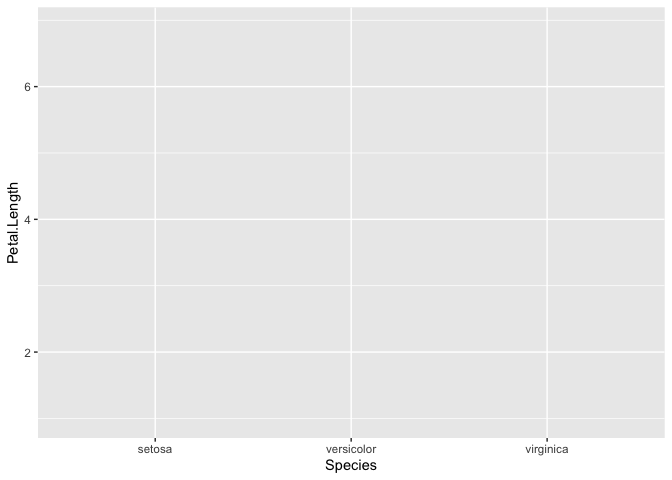
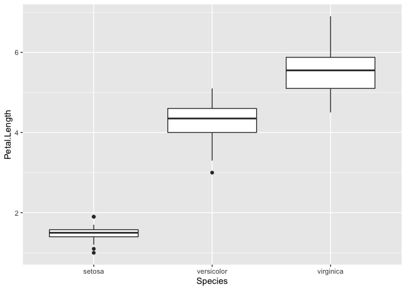
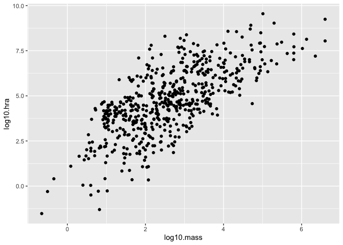
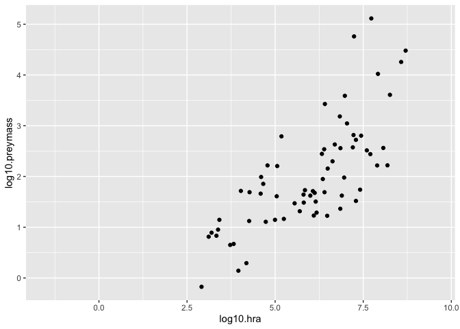
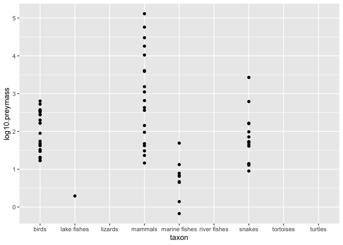
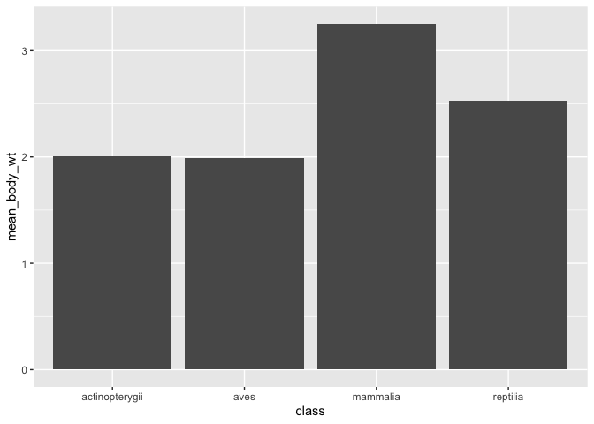
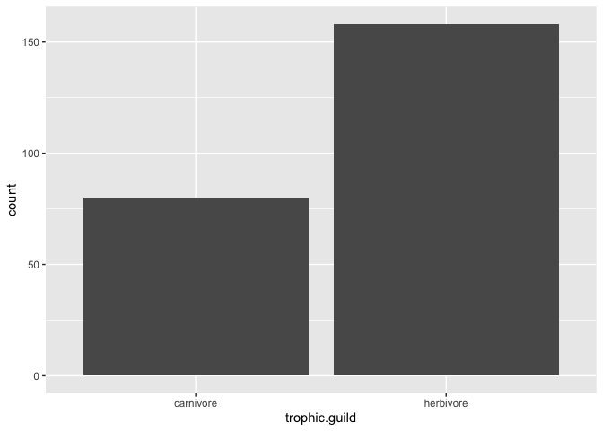
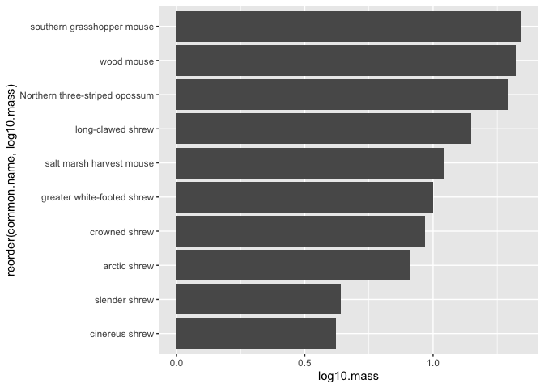

## Learning Goals
*At the end of this exercise, you will be able to:*    
1. Understand and apply the syntax of building plots using `ggplot2`.  
2. Build a boxplot using `ggplot2`.  
3. Build a scatterplot using `ggplot2`.  
4. Build a barplot using `ggplot2` and show the difference between `stat=count` and `stat=identity`.  

## Where have we been, and where are we going?
At this point you should feel comfortable working in RStudio and using dplyr and tidyr. You also know how to produce statistical summaries of data and deal with NA's. It is OK if you need to go back through the labs and find bits of code that work for you, but try and force yourself to originate new chunks.  

## Group Project
Meet with your group and decide on a data set that you will use for your project. Be prepared to discuss these data, where you found them, and what you hope to learn.  

##Resources
- [ggplot2 cheatsheet](https://www.rstudio.com/wp-content/uploads/2015/03/ggplot2-cheatsheet.pdf)

## Load the libraries

```r
library(tidyverse)
library(naniar)
```

## Grammar of Graphics
The ability to quickly produce and edit graphs and charts is a strength of R. These data visualizations are produced by the package `ggplot2` and it is a core part of the tidyverse. The syntax for using ggplot is specific and common to all of the plots. This is what Hadley Wickham calls a [Grammar of Graphics](http://vita.had.co.nz/papers/layered-grammar.pdf). The "gg" in `ggplot` stands for grammar of graphics.

## Philosophy
What makes a good chart? In my opinion a good chart is elegant in its simplicity. It provides a clean, clear visual of the data without being overwhelming to the reader. This can be hard to do and takes some careful thinking. Always keep in mind that the reader will almost never know the data as well as you do so you need to be mindful about presenting the facts.  

## Data Types
We first need to define some of the data types we will use to build plots.  

+ `discrete` quantitative data that only contains integers
+ `continuous` quantitative data that can take any numerical value
+ `categorical` qualitative data that can take on a limited number of values
**Characters, factors fall under categorical**
## Basics
The syntax used by ggplot takes some practice to get used to, especially for customizing plots, but the basic elements are the same. It is helpful to think of plots as being built up in layers. In short, **plot= data + geom_ + aesthetics**.  

We start by calling the ggplot function, identifying the data, and specifying the axes. We then add the `geom` type to describe how we want our data represented. Each `geom_` works with specific types of data and R is capable of building plots of single variables, multiple variables, and even maps. Lastly, we add aesthetics.

ggplot works best with tidy data, so it is sometimes necessary to tidy data before plotting. We will start with tidy data for simplicity. 

## Example
To make things easy, let's start with some built in data.

```r
?iris
names(iris)
```

```
## [1] "Sepal.Length" "Sepal.Width"  "Petal.Length" "Petal.Width"  "Species"
```

```r
glimpse(iris)
```

```
## Observations: 150
## Variables: 5
## $ Sepal.Length <dbl> 5.1, 4.9, 4.7, 4.6, 5.0, 5.4, 4.6, 5.0, 4.4, 4.9, 5.4, 4<U+2026>
## $ Sepal.Width  <dbl> 3.5, 3.0, 3.2, 3.1, 3.6, 3.9, 3.4, 3.4, 2.9, 3.1, 3.7, 3<U+2026>
## $ Petal.Length <dbl> 1.4, 1.4, 1.3, 1.5, 1.4, 1.7, 1.4, 1.5, 1.4, 1.5, 1.5, 1<U+2026>
## $ Petal.Width  <dbl> 0.2, 0.2, 0.2, 0.2, 0.2, 0.4, 0.3, 0.2, 0.2, 0.1, 0.2, 0<U+2026>
## $ Species      <fct> setosa, setosa, setosa, setosa, setosa, setosa, setosa, <U+2026>
```

To make a plot, we need to first specify the data and map the aesthetics. The aesthetics include how each variable in our dataset will be used. In the example below, I am using the aes() function to identify the x and y variables in the plot.

```r
ggplot(data = iris, mapping = aes(x = Species, y = Petal.Length))
```

<!-- -->
**aes= aesthetics**
Notice that we have a nice background, labeled axes, and even values of our variables- but no plot. This is because we need to tell ggplot how we want our data represented. This is called the geometry or `geom()`. There are many types of `geom`, see the ggplot [cheatsheet](https://www.rstudio.com/wp-content/uploads/2015/03/ggplot2-cheatsheet.pdf).

Here we specify that we want a boxplot, indicated by `geom_boxplot()`.

```r
ggplot(data = iris, mapping = aes(x = Species, y = Petal.Length)) +
  geom_boxplot()
```

<!-- -->

## Practice
1. Use the iris data to build a scatterplot that compares sepal length vs. sepal width. Use the cheatsheet or help to find the correct `geom_` for a scatterplot.

```r
ggplot(data = iris, mapping = aes(x = Sepal.Length, y = Sepal.Width)) +
  geom_point()
```

<!-- -->


## Scatterplots, barplots, and boxplots
Now that we have a general idea of the syntax, let's start by working with two standard plots: 1) scatterplots and 2) barplots.

## Data
For the following examples, I am going to use data about vertebrate home range sizes.  

**Database of vertebrate home range sizes.**  
Reference: Tamburello N, Cote IM, Dulvy NK (2015) Energy and the scaling of animal space use. The American Naturalist 186(2):196-211. http://dx.doi.org/10.1086/682070.  
Data: http://datadryad.org/resource/doi:10.5061/dryad.q5j65/1  


```r
homerange <- 
  readr::read_csv("data/Tamburelloetal_HomeRangeDatabase.csv")
```

## Practice
1. Does the homerange data have any NAs? Do a quick exploratory analysis of your choice below.

```r
homerange%>%
  purrr::map_df(~ sum(is.na(.)))
```

```
## # A tibble: 1 x 24
##   taxon common.name class order family genus species primarymethod     N
##   <int>       <int> <int> <int>  <int> <int>   <int>         <int> <int>
## 1     0           0     0     0      0     0       0             1   375
## # <U+2026> with 15 more variables: mean.mass.g <int>, log10.mass <int>,
## #   alternative.mass.reference <int>, mean.hra.m2 <int>, log10.hra <int>,
## #   hra.reference <int>, realm <int>, thermoregulation <int>, locomotion <int>,
## #   trophic.guild <int>, dimension <int>, preymass <int>, log10.preymass <int>,
## #   PPMR <int>, prey.size.reference <int>
```


### 1. Scatter Plots
Scatter plots are good at revealing relationships that are not readily visible in the raw data. For now, we will not add regression lines or calculate any r^2^ values.  

In the case below, we are exploring whether or not there is a relationship between animal mass and homerange. We are using the log transformed values because there is a large difference in mass and homerange among the different species in the data.

```r
ggplot(data = homerange, mapping = aes(x = log10.mass, y = log10.hra)) +
  geom_point()
```

<!-- -->

In big data sets with lots of similar values, overplotting can be an issue. `geom_jitter()` is similar to `geom_point()` but it helps with overplotting by adding some random noise to the data and separating some of the individual points.

```r
ggplot(data = homerange, mapping = aes(x = log10.mass, y = log10.hra)) +
  geom_jitter()
```

<!-- -->

You want to see the regression line, right?

```r
ggplot(data=homerange, mapping=aes(x=log10.mass, y=log10.hra)) +
  geom_jitter()+
  geom_smooth(method=lm, se=F) #adds the regression line, `se=TRUE` will add standard error
```

<!-- -->

### Practice
1. What is the relationship between log10.hra and log10.preymass? What do you notice about how ggplot treats NAs?

```r
homerange %>% 
  select(log10.hra, log10.preymass) %>% 
  na_if("-999")
```

```
## # A tibble: 569 x 2
##    log10.hra log10.preymass
##        <dbl>          <dbl>
##  1      5.45         NA    
##  2      2.45         NA    
##  3      2.06         NA    
##  4      2.10         NA    
##  5      1.94         NA    
##  6      4.59         NA    
##  7      3.96          0.143
##  8      4.65         NA    
##  9      1.05         NA    
## 10      4.51         NA    
## # <U+2026> with 559 more rows
```

```r
ggplot(data=homerange, aes(x=log10.hra, y=log10.preymass))+
  geom_point(na.rm=T)
```

<!-- -->


```r
ggplot(data=homerange, aes(x=taxon, y=log10.preymass))+
  geom_point(na.rm=T)
```

<!-- -->


### 2A. Bar Plot: `stat="count"`
When making a bar graph, the default is to count the number of observations in the specified column. This is best for categorical data. Here, I want to know how many carnivores vs. herbivores are in the data.  

Notice that we can use pipes! Also, the `mapping=` function is implied by `aes` and so is often left out.  

```r
homerange %>% 
  ggplot(aes(x = trophic.guild))+
  geom_bar(stat = "count")
```

<!-- -->

### 2B. Bar Plot: `stat="identity"`
`stat="identity"` allows us to map a variable to the y axis so that we aren't restricted to counts. In this example, I start by summarizing mean body weight by taxonomic class and then use pipes to build the plot.

```r
homerange %>%
  group_by(class) %>% 
  summarize(mean_body_wt = mean(log10.mass)) %>% 
  ggplot(aes(x = class, y = mean_body_wt)) +
  geom_bar(stat = "identity")
```

<!-- -->

## Practice
1. Filter the `homerange` data to include `mammals` only.

```r
mammal_homerange <- homerange %>% 
  filter(class== "mammalia")
mammal_homerange
```

```
## # A tibble: 238 x 24
##    taxon common.name class order family genus species primarymethod N    
##    <chr> <chr>       <chr> <chr> <chr>  <chr> <chr>   <chr>         <chr>
##  1 mamm<U+2026> giant gold<U+2026> mamm<U+2026> afro<U+2026> chrys<U+2026> chry<U+2026> trevel<U+2026> telemetry*    <NA> 
##  2 mamm<U+2026> Grant's go<U+2026> mamm<U+2026> afro<U+2026> chrys<U+2026> erem<U+2026> granti  telemetry*    <NA> 
##  3 mamm<U+2026> pronghorn   mamm<U+2026> arti<U+2026> antil<U+2026> anti<U+2026> americ<U+2026> telemetry*    <NA> 
##  4 mamm<U+2026> impala      mamm<U+2026> arti<U+2026> bovid<U+2026> aepy<U+2026> melamp<U+2026> telemetry*    <NA> 
##  5 mamm<U+2026> hartebeest  mamm<U+2026> arti<U+2026> bovid<U+2026> alce<U+2026> busela<U+2026> telemetry*    <NA> 
##  6 mamm<U+2026> barbary sh<U+2026> mamm<U+2026> arti<U+2026> bovid<U+2026> ammo<U+2026> lervia  telemetry*    <NA> 
##  7 mamm<U+2026> American b<U+2026> mamm<U+2026> arti<U+2026> bovid<U+2026> bison bison   telemetry*    <NA> 
##  8 mamm<U+2026> European b<U+2026> mamm<U+2026> arti<U+2026> bovid<U+2026> bison bonasus telemetry*    <NA> 
##  9 mamm<U+2026> goat        mamm<U+2026> arti<U+2026> bovid<U+2026> capra hircus  telemetry*    <NA> 
## 10 mamm<U+2026> Spanish ib<U+2026> mamm<U+2026> arti<U+2026> bovid<U+2026> capra pyrena<U+2026> telemetry*    <NA> 
## # <U+2026> with 228 more rows, and 15 more variables: mean.mass.g <dbl>,
## #   log10.mass <dbl>, alternative.mass.reference <chr>, mean.hra.m2 <dbl>,
## #   log10.hra <dbl>, hra.reference <chr>, realm <chr>, thermoregulation <chr>,
## #   locomotion <chr>, trophic.guild <chr>, dimension <chr>, preymass <dbl>,
## #   log10.preymass <dbl>, PPMR <dbl>, prey.size.reference <chr>
```


2. Are there more herbivores or carnivores in mammals? Make a bar plot that shows their relative numbers.

```r
mammal_homerange %>% 
  group_by(class) %>% 
  ggplot(aes(x = trophic.guild))+
  geom_bar(stat = "count")
```

<!-- -->


3. Make a bar plot that shows the masses of the top 10 smallest mammals in terms of mass. Be sure to use `stat'="identity"`.

```r
mammal_homerange %>% 
  top_n(-10, log10.mass) %>% 
  ggplot(aes(x =reorder(common.name,log10.mass), y = log10.mass)) +
   geom_bar(stat = "identity") +
  coord_flip()
```

<!-- -->


## That's it, let's take a break!   

-->[Home](https://jmledford3115.github.io/datascibiol/)
